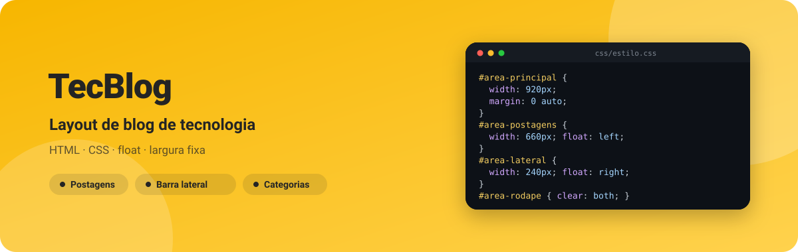
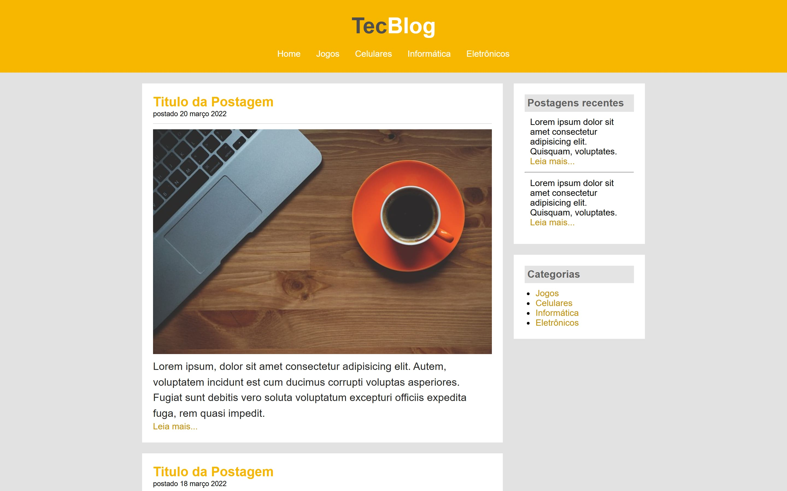

<div align="center">



**Página inicial de um blog de tecnologia em HTML e CSS: cabeçalho com menu, postagens e barra lateral, em layout de float.**

[](https://kessleru.github.io/TecBlog-Web/)
[](LICENSE)
[](https://github.com/kessleru/TecBlog-Web/commits/main)



</div>

## Sobre

Um dos primeiros estudos de layout: a página inicial de um blog com três postagens, uma barra
lateral de **postagens recentes** e **categorias**, e rodapé. Os textos são *lorem ipsum* — o que
importa aqui é a estrutura.

O layout é o clássico de antes do Flexbox e do Grid: um container de **920px** centralizado, a
coluna de postagens flutuando à esquerda, a barra lateral à direita, e o rodapé com `clear: both`
para voltar ao fluxo normal.

```css
#area-principal { width: 920px; margin: 0 auto; }
#area-postagens { width: 660px; float: left; }
#area-lateral   { width: 240px; float: right; }
#area-rodape    { clear: both; }
```

## O que tem e o que não tem

| | |
|---|---|
| ✅ **Cabeçalho** | Logo em duas cores e menu com Home, Jogos, Celulares, Informática e Eletrônicos |
| ✅ **Postagens** | Título, data, imagem, resumo e link "Leia mais..." |
| ✅ **Barra lateral** | Postagens recentes e lista de categorias |
| ⚠️ **Só a página inicial** | Os links do menu apontam para páginas (`jogos.html`, …) que ainda não existem |
| ⚠️ **Largura fixa** | Sem media queries: em telas mais estreitas que 920px o layout não se adapta |

## Stack

| Camada | Ferramenta |
|---|---|
| Marcação | HTML5 |
| Estilo | CSS3 — `float`, `clear`, largura fixa |
| Deploy | [GitHub Pages](https://pages.github.com) |

## Rodando localmente

```bash
git clone https://github.com/kessleru/TecBlog-Web.git
cd TecBlog-Web
python -m http.server 8000
```

Abra `http://localhost:8000`. Não há dependências nem build — abrir o `index.html` direto no
navegador também funciona.

## Estrutura

```
├── index.html
├── css/
│   └── estilo.css
└── imagens/          # fotos das postagens
```

<details>
<summary><b>Regerando as imagens deste README</b></summary>

```bash
node .github/readme/gerar.mjs                 # banner.svg

python -m http.server 8000                    # em outro terminal
npm i --no-save puppeteer-core sharp
node .github/readme/capturar.mjs              # tela em 2x
```

</details>

---

<div align="center">
<sub>Feito por <a href="https://github.com/kessleru">Otávio Kessler Ustra</a> · <a href="LICENSE">MIT</a></sub>
</div>
